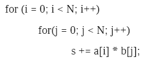

# Два вектора
1) Написать 3 программы, каждая из которых рассчитывает число s по двум данным
векторам a и b равной длины N в соответствии со следующим двойным циклом:

- последовательная программа
- параллельная, использующая коммуникации типа точка-точка (MPI_Send, MPI_Recv)
- параллельная, использующая коллективные коммуникации (MPI_Scatter, MPI_Reduce,
MPI_Bcast)
2) Замерить время работы последовательной программы и параллельных на 2, 4, 8, 16, 24
процессах. Рекомендуется провести несколько замеров для каждого варианта запуска и
выбрать минимальное время.
3) Построить графики времени, ускорения и эффективности.
4) Составить отчет, содержащий исходные коды разработанных программ и построенные
графики.

### Требования:
- длину векторов выбирать таким образом, чтобы время работы последовательной
  программы было не менее 30 сек;
- в параллельных программах изначально оба вектора должны полностью
  инициализироваться на 0-м процессе. Для параллельного расчета 0-й процесс должен
  раздавать части одного из векторов остальным, а второй вектор передавать полностью
  каждому процессу;
- в параллельных программах полное скалярное произведение должно в результате
  выводиться на экран 0-м процессом.