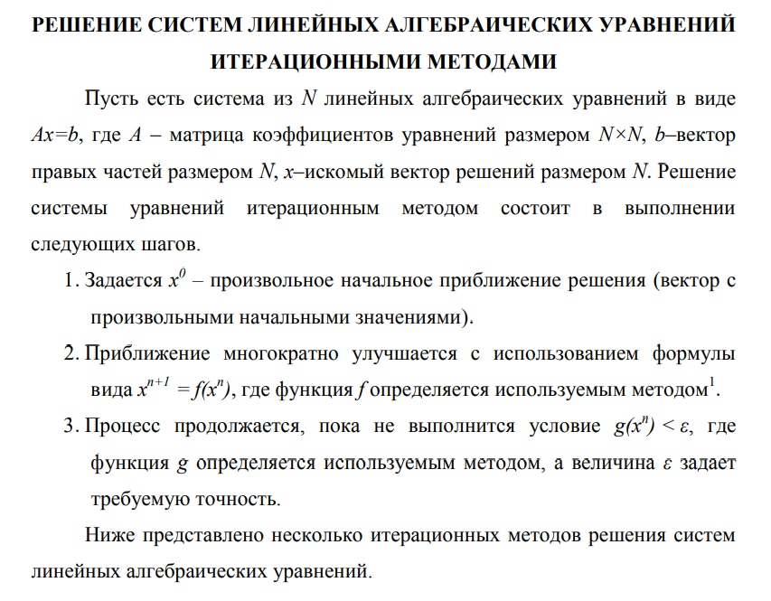
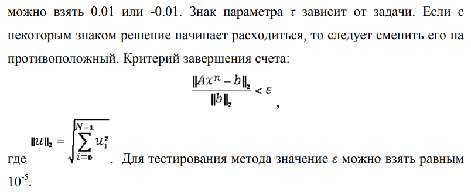

## Параллельная реализация решения системы линейных алгебраических уравнений с помощью MPI

1. Написать 2 программы (последовательную и параллельную с
   использованием MPI) на языке C/C++, которые реализуют итерационный
   алгоритм решения системы линейных алгебраических уравнений вида Ax=b в
   соответствии с выбранным вариантом. Здесь A– матрица размером N×N, x и b
   – векторы длины N. Тип элементов – double.
2. Параллельную программу реализовать с тем условием, что матрица A и
   вектор b инициализируются на каком-либо одном процессе, а затем матрица
   A «разрезается» по строкам на близкие по размеру, возможно не одинаковые,
   части, а вектор b раздается каждому процессу.
   Уделить внимание тому, чтобы при запуске программы на различном
   числе MPI-процессов решалась одна и та же задача (исходные данные
   заполнялись одинаковым образом).
3. Замерить время работы последовательного варианта программы, а также
   время работы параллельного при использовании различного числа
   процессорных ядер. Минимально на 2, 4, 8, 16, 24 (на каждом из наших узлов
   кластера по 12 ядер), но чем на большем количестве различного числа
   процессов будут выполнены замеры, тем лучше. Также чем больше замеров
   будет выполнено на одном и том же числе процессов, тем лучше. В этом
   случае для построения графиков следует брать минимальное время.
   Построить графики зависимости времени работы программы, ускорения и
   эффективности распараллеливания от числа используемых ядер. Исходные
   данные, параметры N и ε подобрать таким образом, чтобы решение задачи
   на одном ядре занимало не менее 30 секунд.
4. Выполнить профилирование двух вариантов программы с помощью
   jumpshot или ITAC (Intel Trace Analyzer and Collecter) при использовании 16-
   и или 24-х ядер.
5. На основании полученных результатов сделать вывод.