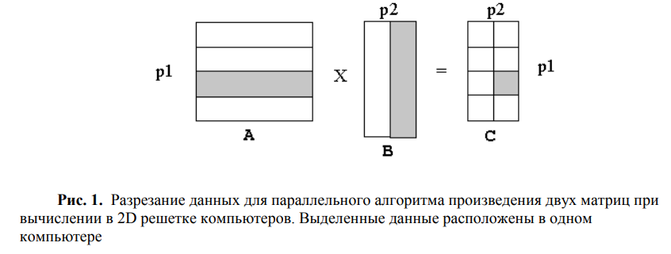
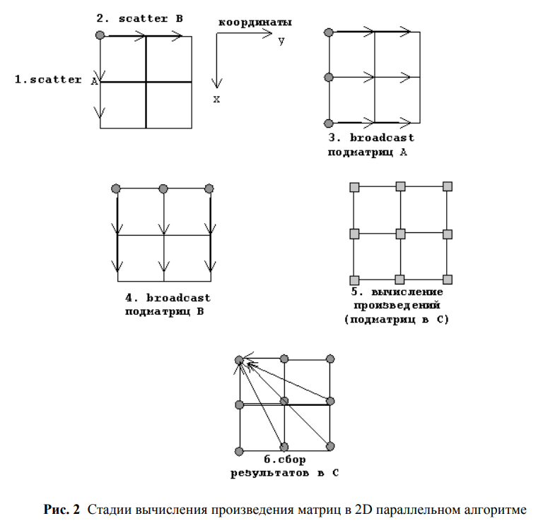

## Умножение матрицы на матрицу в MPI 2D-решётке

### Описание алгоритма
Вычисляется произведение С = А × В, где А – матрица размера 𝑛1 × 𝑛2 и В –матрица
𝑛2 × 𝑛3. Матрица результатов С имеет размер 𝑛1 × 𝑛3. Исходные матрицы первоначально
доступны на нулевом процессе, и матрица результатов возвращена в нулевой процесс.
Параллельное выполнение алгоритма осуществляется на двумерной (2D) решетке
компьютеров размером 𝑝1 × 𝑝2. Матрицы разрезаны, как показано на Рис. 1: матрица А
разрезана на 𝑝1 горизонтальных полос, матрица В разрезана на 𝑝2 вертикальных полос, и
матрица результата C разрезана на 𝑝1 × 𝑝2 подматрицы (или субматрицы).

Каждый компьютер (i,j) вычисляет произведение i-й горизонтальной полосы
матрицы A и j-й вертикальной полосы матрицы B, произведение получено в подматрице
(i,j) матрицы C.
1. Матрица А распределяется по горизонтальным полосам вдоль координаты (x,0).
2. Матрица B распределяется по вертикальным полосам вдоль координаты (0,y).
3. Полосы А распространяются в измерении y.
4. Полосы B распространяются в измерении х.
5. Каждый процесс вычисляет одну подматрицу произведения.
6. Матрица C собирается из (x,y) плоскости

Осуществлять пересылки между компьютерами во время вычислений не нужно, т. к.
все полосы матрицы А пересекаются со всеми полосами матрицы B в памяти компьютеров
системы.
   
Последовательные стадии вычисления иллюстрируются на Рис. 2:

