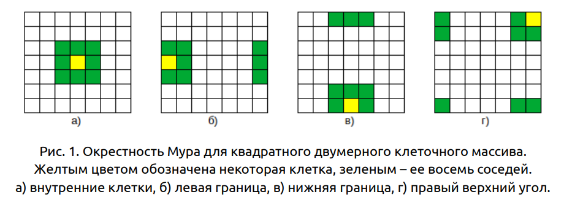
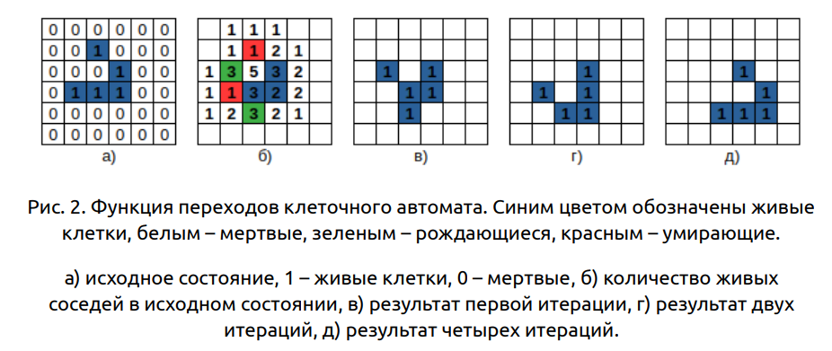
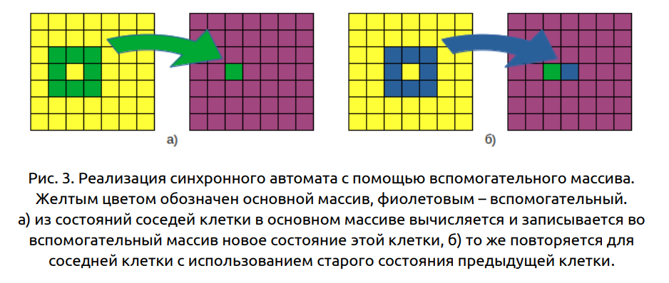
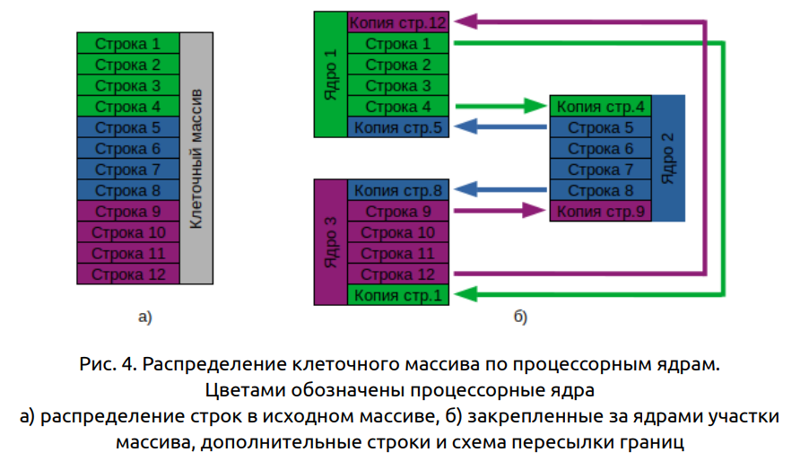
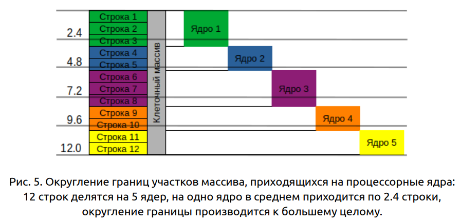

## Игра "Жизнь" Дж. Конвея
**Цель работы**: практическое освоение методов реализации алгоритмов
мелкозернистого параллелизма на крупноблочном параллельном
вычислительном устройстве на примере реализации клеточного автомата «Игра
"Жизнь" Дж. Конвея» с использованием неблокирующих коммуникаций
библиотеки MPI.

### Задание
1. Написать параллельную программу на языке C/C++ с использованием MPI,
   реализующую клеточный автомат игры "Жизнь" с завершением программы по
   повтору состояния клеточного массива в случае одномерной декомпозиции
   массива по строкам и с циклическими границами массива. Проверить корректность
   исполнения алгоритма на различном числе процессорных ядер и различных
   размерах клеточного массива, сравнив с результатами, полученными для исходных
   данных вручную.
2. Измерить время работы программы при использовании различного числа
   процессорных ядер: 1, 2, 4, 8, 16, … . Размеры клеточного массива X и Y подобрать
   таким образом, чтобы решение задачи на одном ядре занимало не менее 30
   секунд. Построить графики зависимости времени работы, ускорения и
   эффективности распараллеливания от числа используемых ядер.
3. Произвести профилирование программы и выполнить ее оптимизацию.
   Попытаться достичь 50-процентной эффективности параллельной реализации на
   16 ядрах для выбранных X и Y.